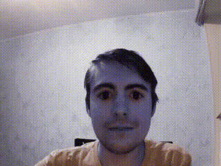

# Gaze correction project

## Description:
During the pandemic, the number of video calls increased due to the self-isolation regime. Often during conversations, people's eyes are directed at the screen rather than at the camera. It turns out that the conversation partners are looking in different directions during the dialogue, and their eyes are half-covered or looking sideways during the call.

We propose to solve this problem by modifying the eye pupil image during a video conversation.
As a result of the algorithm, we will get open eyes looking into the camera and happy partners communicating eye-to-eye.

Although we plan to apply our algorithm to video, we have to start with a small step.
Our first stage was to implement it on photos.
We used selfies of ourselves and other people as our main dataset.
During the process of dataset generation, it was essential to select photos that cover as much as possible the potential cases that appear in the process of communication on a video call. These are covered eyes, eyes looking sideways, squinted eyes.

## Algorithm:
Our first step is to define the face area of the picture. It is necessary to reduce the area where the eyes are potentially located.

Once the face is found, we look for the eye area. It is important to find the eyes, not the nostrils. Within the limits of this area, all the transformations will be performed later on.
These iterations are done with CascadeClassifiers.  This method is based on Haar primitives. By applying different templates, we detect first the face area and then the eyes.

Next, we need to find the point of symmetry between the eyes. For this we use elementary geometric transformations. We find the symmetry point, which is located on the same line as the eyes and the nose.

Knowing the face points and the symmetry point we can find the direction vector of the gaze.  We use a convolutional neural network based on Mobile Net V2 with 3 convolution level to find it.

Now we can find the shift of the gaze along the axes, using the symmetry point and the gaze direction vector. We can use them to divide our picture into 9 areas. If the displacement is around zero, we think the gaze is pointing straight ahead. If the displacement is large on two axes, we think the gaze is directed to the lower right corner of the picture, and so on.
Next, we find the face points using the standard Face Alignment library, which is based on FAN's state-of-the-art deep learning based.
Finally, we get the eye points using the face points, the eye area, and simple transformations.

By the eye points we crop the eyes for further processing.
Using shifts and reassignments, we move pixels from the original image location to their location in the new image.  For the matching process, we apply compression and stretching according to the directional vectors found. Finally, we return the eyes to the original location of the picture.

## Presentation:
[PDF presentation](https://github.com/lll-phill-lll/gaze_correction/blob/master/presentation.pdf)

[Video presentation](https://youtu.be/GSdnbT9DE1Q)

## Results:

## Eye detection:

## Gif demo:

Authors: [Ildar Gabdrakhmanov](https://github.com/KotShredinger),  [Mikhail Filitov](https://github.com/lll-phill-lll), [Varvara Shushkova](https://github.com/shushkova)
----------
